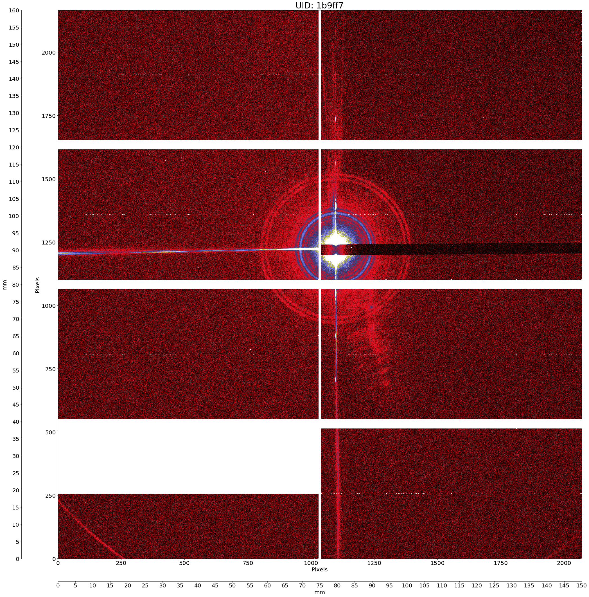
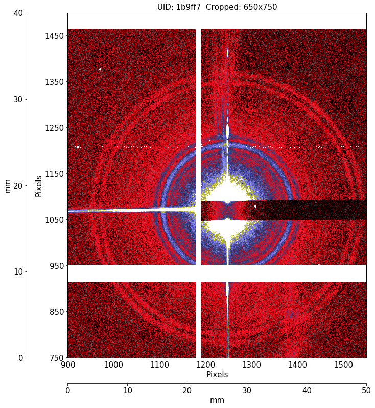
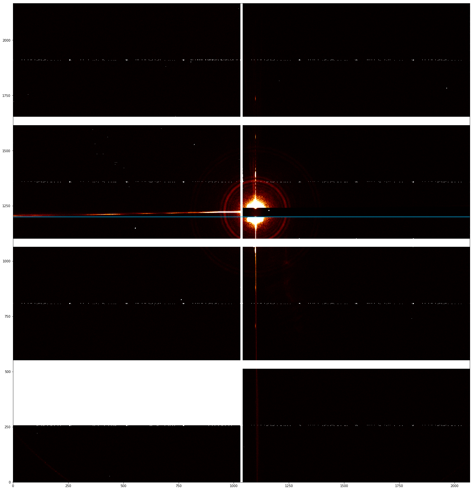
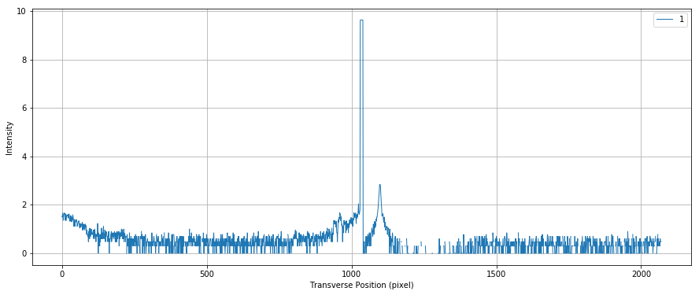
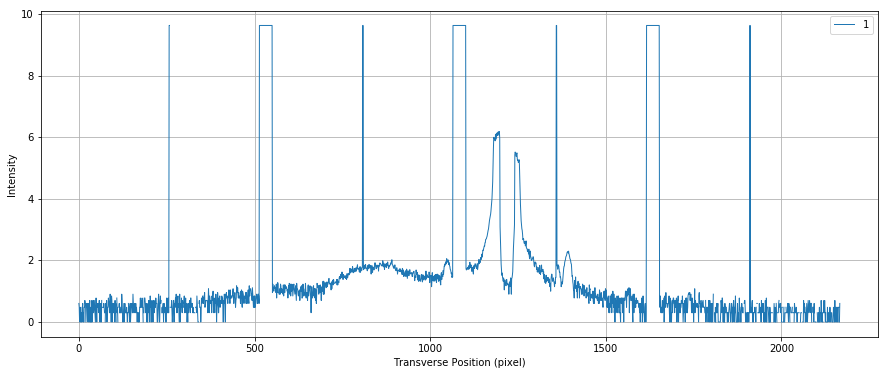

# srw-image-tools
Retrieve data from CHX (NSLSII Hard X-ray beamline) BlueSky servers and edit images from the eiger detector.

Title: srw-image-tools<br/>
Author: Rebecca Coles<br/>
Updated on Aug 20, 2019<br/>

This notebook can be used on the CHX Jupyter Hub:
https://notebook.nsls2.bnl.gov

# Table of Contents
1. [Required Python Packages](#required)
2. [Functions](#functions)
    1. [save_hdf5](#save_hdf5)
    2. [plot_profile_horiz](#plot_profile_horiz)
    3. [plot_profile_vert](#plot_profile_vert)
    4. [display_image_in_actual_size](#display_image_in_actual_size)
    5. [display_cropped_image](#display_cropped_image)
    6. [plot_eiger_for_srw](#plot_eiger)
3. [Example Output](#example_output)
    1. [get_meta_data](#get_meta_data)
    2. [plot_eiger_for_srw](#plot_eiger)

## Required Python Packages <a name="required"></a>
Required Python Packages:<br/>
* os: https://docs.python.org/3/library/os.html
* matplotlib.pyplot: https://matplotlib.org/3.1.1/api/_as_gen/matplotlib.pyplot.plot.html
* numpy: https://numpy.org/
* h5py: https://www.h5py.org/
* warnings: https://docs.python.org/3/library/warnings.html

External CHX package:<br/>
* pyCHX.chx_xpcs_xsvs_jupyter_V1:<br/> 
	https://github.com/NSLS-II-CHX/pyCHX/blob/master/pyCHX/chx_xpcs_xsvs_jupyter_V1.py

## Functions <a name="functions"></a>

### save_hdf5 <a name="save_hdf5"></a>
Access BlueSky HDF5 binary data from CHX measurement.<br/>

`def save_hdf5(data, filename='data.h5', dataset='dataset')`
        
param data: HDF5 binary data from CHX measurement.<br/>
param filename='data.h5': HDF5 filename. Default is contained in the header file.<br/>
param dataset='dataset': Creates dataset type. Default is dataset.<br/>

return: string status of dataset creation.

### plot_profile_horiz <a name="plot_profile_horiz"></a>
Show plot of intensity versus horizontal position.<br/>

`def plot_profile_horiz(data, uid, y_crd=1200, dpi=80, clim=(0, 200), cmap='afmhot', line_color='deepskyblue', linestyles=None)`

param data: HDF5 binary data from CHX measurement.<br/>
param uid: unique ID automatically assigned to a CHX measurement.<br/>
param y_crd=1200: add a horizontal line across the axis at a given location on the image.<br/>
param dpi=80: dpi (dots per inch) for output image.<br/>
param clim=(0, 200): sets the color limits of the current image.<br/>
param cmap='afmhot': color map (https://matplotlib.org/examples/color/colormaps_reference.html)<br/>
param line_color='red': color of line that will show the cut location.<br/>

### plot_profile_vert <a name="plot_profile_vert"></a>
Show plot of intensity versus vertical position.<br/>

`def plot_profile_vert(data, uid, x_crd=1100, dpi=80, clim=(0, 200), cmap='afmhot', line_color='deepskyblue', linestyles=None)`

param data: HDF5 binary data from CHX measurement.<br/>
param uid: unique ID automatically assigned to a CHX measurement.<br/>
param x_crd=1100: add a vertical line across the axis at a given location on the image.<br/>
param dpi=80: dpi (dots per inch) for output image.<br/>
param clim=(0, 200): sets the color limits of the current image.<br/>
param cmap='afmhot': color map (https://matplotlib.org/examples/color/colormaps_reference.html) <br/>
param line_color='red': color of line that will show the cut location.<br/> 
param linestyles=None: custom linestyles.<br/> 

### display_image_in_actual_size <a name="display_image_in_actual_size"></a>
Display CHX Eiger image in full size and save the image as a TIFF with dual pixel and mm axis.<br/> 

`def display_image_in_actual_size(img, uid, dpi=80, eiger_size_per_pixel=0.075, clim=(0, 100), cmap='gist_stern')`

param im: eiger detector image.<br/> 
param uid: unique ID automatically assigned to a CHX measurement.<br/> 
param dpi=80: dpi (dots per inch) for output image.<br/> 
param eiger_size_per_pixel=0.075: eiger camera has 75 um per pixel.<br/> 
param cmap='gist_stern': color map (https://matplotlib.org/examples/color/colormaps_reference.html) <br/> 
param clim: sets the color limits of the current image.<br/> 

### display_cropped_image <a name="display_cropped_image"></a>
Display CHX eiger image cropped to user specifications and save the image as a TIFF with dual pixel and mm axis.<br/> 
 
`def display_cropped_image(img, uid, x1=900, x2=1650, y1=750, y2=1400, dpi=80, eiger_size_per_pixel=0.075, 
                          clim=(0, 100), cmap='gist_stern')`

param im: eiger detector image.<br/>
param uid: unique ID automatically assigned to a CHX measurement.<br/>
param x1=900: x-axis stating location (columns).<br/>
param x2=1650: x-axis final location (columns).<br/>
param y1=750: y-axis stating location (rows).<br/>
param y2: y-axis final location (rows).<br/>
param dpi=80: dpi (dots per inch) for output image.<br/>
param eiger_size_per_pixel=0.075: eiger camera has 75 um per pixel.<br/>
param cmap='gist_stern': color map (https://matplotlib.org/examples/color/colormaps_reference.html)<br/>
param clim: sets the color limits of the current image.<br/>

### plot_eiger_for_srw <a name="plot_eiger"></a>
Display CHX eiger image: fullsize, cropped to user specifications, and with horizontal and vertical cuts, and save the plots and images as a TIFFs. <br/> 

`def plot_eiger_for_srw(uid, det='eiger4m_single_image', cmap='afmhot', clim=(0, 100), mean=False, frame_num=0, grid=False)`

param uid: unique ID automatically assigned to a CHX measurement.<br/> 
param det='eiger4m_single_image': which eiger dector.<br/> 
param cmap='gist_stern': color map (https://matplotlib.org/examples/color/colormaps_reference.html) <br/> 
param clim=(0, 200): sets the color limits of the current image.<br/> 
param mean=False: mean of combined images along axis 0.<br/> 
param frame_num=0: which image to use.<br/> 
param grid=False: grid on the image.<br/> 

## Example Output <a name="example_output"></a>

### get_meta_data <a name="get_meta_data"></a>
Using the get_meta_data from the CHX package:<br/> 

`get_meta_data('1b9ff7',verbose=True)`

where 1b9ff7 is the UID for the CHX measurement, gives the output:

```
 {'suid': '1b9ff7',
 'filename': '/XF11ID/data/2017/10/24/98e7508f-61f3-4c03-909a_4806_master.h5',
 'detector': 'eiger4m_single_image',
 'beam_center_x': 1098.0,
 'beam_center_y': 1225.0,
 'wavelength': 1.2846771478652954,
 'det_distance': 10.038560260000002,
 'cam_acquire_time': 60.0,
 'cam_acquire_period': 60.0000114440918,
 'cam_num_images': 1,
 'threshold_energy': 4825.5,
 'photon_energy': 9651.0,
 'detectors': ['eiger4m_single'],
 'num': 1,
 'time': 1508886690.4590404,
 'uid': '1b9ff785-e508-4438-875c-6d04123bd9b3',
 'scan_id': 8289,
 'hints': {'dimensions': [[['time'], 'primary']]},
 'run': '2017-3',
 'user': 'Chubar',
 'scatterer': 'R5',
 'Measurement': 'R5 - 60s exposure, MBS:0.05x0.4',
 'beamline_id': 'CHX',
 'MBS': '0.05x0.4',
 'plan_type': 'generator',
 'num_intervals': 0,
 'plan_name': 'count',
 'num_points': 1,
 'sample': 'Litho 4 - Julien',
 'owner': 'xf11id',
 'start_time': '2017-10-24 19:11:30',
 'stop_time': '2017-10-24 19:12:32',
 'img_shape': [2167, 2070],
 'verbose': True}
 ```
 
 ### plot_eiger_for_srw <a name="plot_eiger"></a>
 Using the plot_eiger_for_srw definition:<br/> 
 
 `def plot_eiger_for_srw(uid, det='eiger4m_single_image', cmap='afmhot',
                       clim=(0, 100), mean=False, frame_num=0, grid=False)`
 
 where if, for example, 1b9ff7 is the UID for the CHX measurement, gives the output:<br/> 
 
```
{'eiger4m_single_stats4_total', 'eiger4m_single_stats2_total', 'eiger4m_single_image', 'eiger4m_single_stats3_total', 'eiger4m_single_stats1_total', 'eiger4m_single_stats5_total'}
(1, 1, 2167, 2070)
min: 0, max: 4294967295
<Figure size 432x288 with 0 Axes>
```
<br/>
<br/>
`Horizontal cut at row 1200`<br/>
<br/>
<br/>
`Vertical cut at column 1100`<br/>
<br/>
<br/>

```
[<Frames>
 Length: 1 frames
 Frame Shape: 2167 x 2070
 Pixel Datatype: uint32]
 ```
